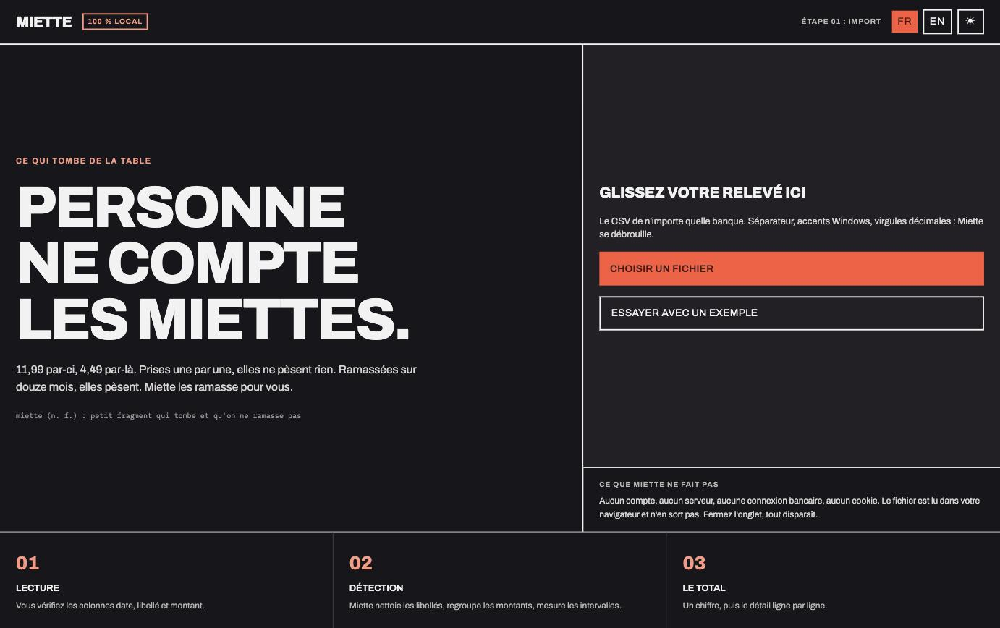
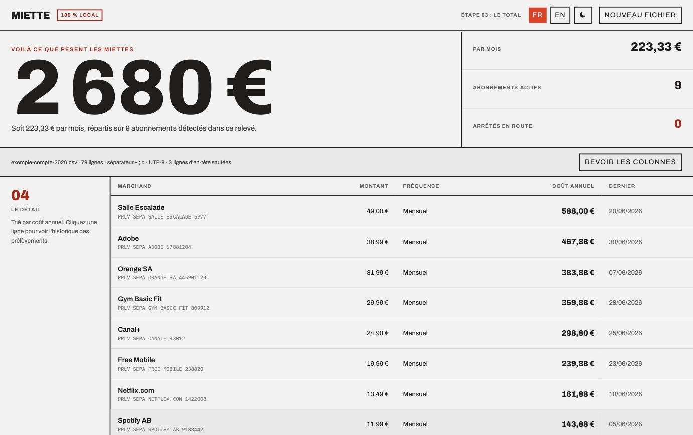

# Miette

**Personne ne compte les miettes.**

11,99 par-ci, 4,49 par-là. Prises une par une, les petites dépenses récurrentes ne pèsent
rien, et personne ne les surveille. Ramassées sur douze mois, elles pèsent.

Miette lit l'export CSV de votre banque et vous dit ce que vos prélèvements récurrents
vous coûtent sur un an. Le fichier ne quitte jamais votre navigateur.



---

## Traitement entièrement local

Aucun compte, aucun serveur, aucune connexion bancaire, aucun cookie, aucune requête
réseau. Le CSV est lu et analysé dans la page, en mémoire. Fermez l'onglet, tout
disparaît. Les polices sont auto-hébergées, il n'y a donc pas non plus d'appel vers un
CDN au chargement.

C'est vérifiable : ouvrez l'onglet réseau des outils de développement pendant l'analyse.

## Ce que ça donne



Trois familles, chacune avec son total :

| Famille | Ce qu'on y trouve |
|---|---|
| **Abonnements** | Ce qui se résilie. C'est le grand chiffre du haut. |
| **Charges fixes** | Loyer, impôts, crédit, assurance, énergie. Récurrent, mais on ne le résilie pas : compté à part pour ne pas noyer le reste. |
| **Dépenses régulières** | Les commerces où l'on retourne, les virements. Projetés sur douze mois pour voir où part l'argent. |

Les abonnements qui se sont arrêtés en cours de route sont signalés et sortis du total.

## Comment la détection fonctionne

Un abonnement, ce n'est pas « une dépense tous les trente jours environ ». C'est **le même
montant, au centime, qui revient à date fixe**. Toute la détection découle de là.

**Sous-séries de montant identique.** Pour chaque marchand, on cherche les groupes de
transactions au montant strictement égal. Un restaurant ne facture jamais six fois
exactement 9,99 €. Ce découpage isole aussi un abonnement noyé dans des achats à l'unité
sous le même libellé, et fait ressortir les abonnements cachés derrière un intermédiaire
de paiement, que le libellé seul ne permet pas d'identifier.

**Rythme calendaire.** L'écart entre deux échéances est mesuré en mois, déduit du nombre
de jours : entre le 2 mars et le 31 mars il n'y a aucune frontière de mois franchie,
pourtant une échéance s'est écoulée. Le pas de la série est le mode de ces écarts, si bien
qu'une échéance manquée creuse un trou sans casser le rythme.

**Ancrage circulaire.** La stabilité de la date est mesurée sur le cercle du mois, donc le
31 et le 1er sont voisins et non opposés. Sans cela, un prélèvement facturé « autour du
1er » (31/01, 02/03, 31/03…) paraît erratique alors qu'il est parfaitement régulier.

**Score de récurrence 0-100** plutôt qu'un booléen : régularité du pas, ancrage, nombre
d'occurrences, montant répété, canal de paiement. Les séries courtes et les commerçants
fréquentés sont plafonnés, parce que trois passages au même prix chez un caviste ne font
pas un abonnement. Au-dessus de 65 c'est retenu, entre 40 et 65 c'est proposé à
validation.

Le parsing gère ce que les banques françaises envoient réellement : séparateur deviné,
Windows-1252, dates en JJ/MM/AAAA, décimales à la virgule, colonnes débit et crédit
séparées, lignes d'en-tête parasites, et références de mandat qui changent à chaque
échéance. Le mapping des colonnes reste corrigeable à la main.

## Lancer le projet

```bash
npm install
npm run dev      # http://localhost:5173
npm test         # 41 tests, node --test, sans framework
npm run build
```

Le bouton « Essayer avec un exemple » charge un relevé fictif : pas besoin de vos vraies
données pour voir ce que ça donne.

## Organisation

```
src/lib/parse.js        lecture du CSV : encodage, séparateur, en-tête, colonnes
src/lib/recurrence.js   arithmétique calendaire, ancrage, paliers de montant
src/lib/classify.js     score de récurrence et rangement en familles
src/lib/detect.js       orchestration
src/lib/spending.js     classement des postes de dépense
src/lib/i18n.js         français et anglais, sans dépendance
src/screens/            import, colonnes, résultats, panneau de détail
```

Français et anglais, détectés depuis le navigateur et changeables dans l'en-tête. Thème
clair et sombre, réglé sur le système par défaut.

## Crédits

Direction artistique et maquettes produites avec Claude Design (design system
« Modernist », conservé dans `_ds/`). Archivo et IBM Plex Mono sont sous licence SIL Open
Font License 1.1.

Aucune licence n'est encore attachée à ce dépôt : tous droits réservés par défaut.
